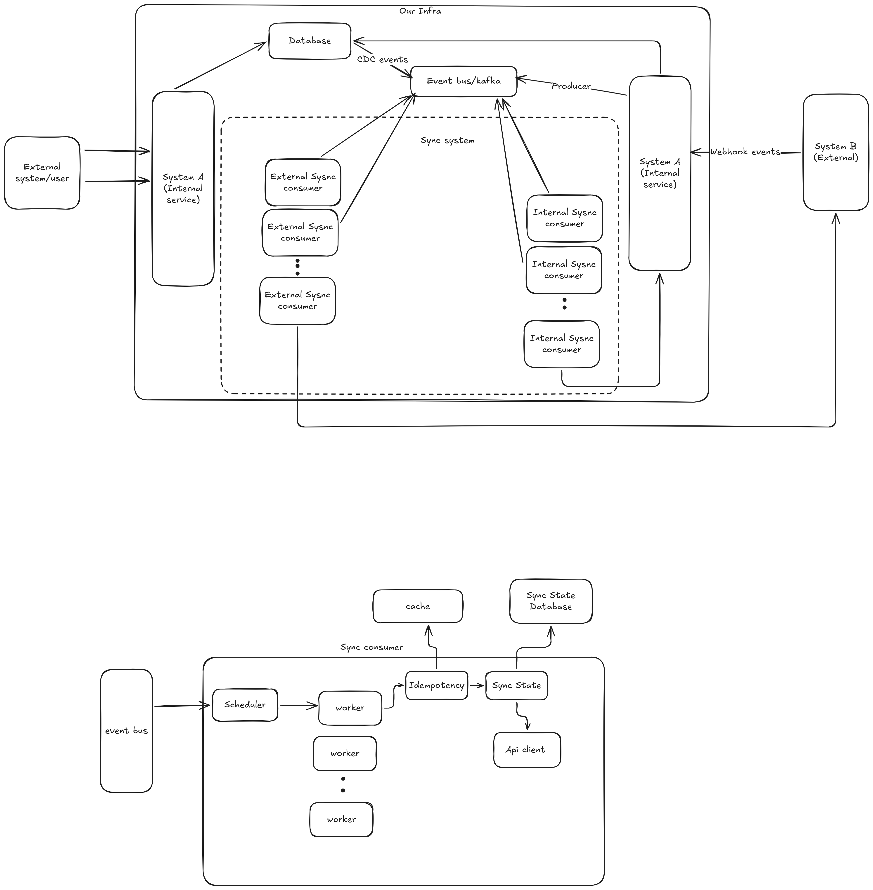

# Record‑to‑Record Sync Service (Internal → External)

This system synchronises records from our internal system  to
various **external systems CRM providers (System B)**. It focuses on the
**Internal → External** direction – consuming internal change events,
transforming them, and applying the corresponding CRUD operations on the
external API respecting rate limits.

## Assumptions
 - Internal system only emits events for genuine changes
 - Single record / record_type needs syncing to/from a single external system.
 - Events are at record level, single event per record.
 - Eventual consistency is fine. Sys A and Sys B maybe temporarily be out of sync.
 - Simple conflict resolution , last write wins.
 - Unique and immutable record_id within out internal system.


## Main Components

1. Event Bus (moslt likely choice is kafka) (mocked)
    A persisten log stream with ordering gaurantees per record (in case of kafka we can create partitions based on  (org_id, record_type) + record_id ) ensuring ordering within the partition.

2. Transformer Registry (mocked)
    Ideally the tranformation can be config based (orgs storing their transformations which are eventually stored in a config file per object for a particular crm provider) , if not provided a global tranformation can be applied.

3. Consumer Worker
    This the core processing unit. Recieves an event, checks idempotency, selects transformer, calls external API with retries, updates the state store. In case of failure after puts the item to DLQ.

4. Scheduler
    Reads events from a shared queue in batches, hashes the `internal_id`, and routes them to the correct `ConsumerWorker` to maintain per‑record ordering.

5. StateStore (mocked)
    Responsible for Maintaining the internal_id - external_id translation per provider (crm / external system)
    
6. IdempotencyStore (mocked)
    Ensures exactly once processing semantics in an at least once delivery system. key -> (org_id, record_id, record_type, version) OR event_id, incase of external to internal sync key -> (org_id, external_id, record_type)

7. CredentialStore (mocked)
    Stores and manages org-specific authentication credentials required to interact with external systems.

8. Rate Limit Cache (mocked)
    Tracks and enforces rate limits per tenant and provider to prevent throttling by external systems. Most likely a TOKEN BUCKET implemented in REDIS.
    key -> (org_id, provider, api[OPTIONAL])

9. Dead Letter QUEUE (DLQ) (mocked)
    Ideally another kafka topic.


## Setup & How to Run

We use `uv` for dependency management and execution.

1. **Install `uv` (if not already)**  
   `curl -LsSf https://astral.sh/uv/install.sh | sh`

2. **Create a virtual environment and install**  
   ```
   uv sync
   ```
3. **Run the demo**
    ```
    uv run python -m sync_service.demo
    ```
4. **Run tests**
    ```
    uv run pytest tests/
    ```

